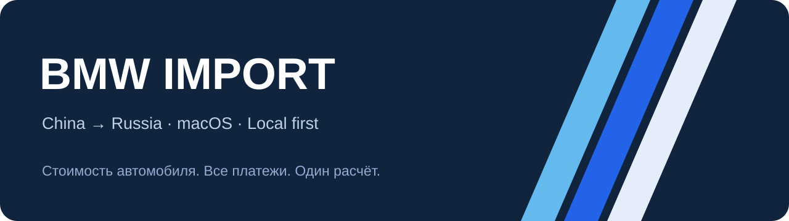

<p align="center"></p>

# BMW Import

**Локальный калькулятор стоимости BMW из Китая в Россию.** Покупка в юанях, таможенные платежи, доставка и предложение клиенту — в одном приложении.

  

[Скачать установщик](https://github.com/Andrles/BMW-Import/releases/download/v0.5.0/BMW-Import-0.5.0-Apple-Silicon.pkg) · [Все релизы](https://github.com/Andrles/BMW-Import/releases) · [Сообщить об ошибке](https://github.com/Andrles/BMW-Import/issues)

## Быстрая установка через терминал

Для **Mac с Apple Silicon, macOS 13.5 или новее**:

```bash
curl -fsSL https://raw.githubusercontent.com/Andrles/BMW-Import/v0.5.0/install.sh | bash
```

Скрипт скачивает фиксированную версию 0.5.0, проверяет SHA-256, затем запрашивает пароль администратора для установки в `/Applications`. Node.js уже входит в приложение. Закройте запущенный BMW Import перед обновлением.

Хотите сначала посмотреть скрипт? [Открыть install.sh](install.sh). Установщик не подписан сертификатом Developer ID и не заверен Apple: macOS может запросить ручное разрешение запуска. Скрипт не отключает Gatekeeper и не меняет настройки безопасности.

## Что умеет

- Каталог BMW и ручной ввод характеристик.
- Месяц и год выпуска; при неизвестном дне в новых расчётах принимается 15-е число.
- Покупка в CNY; официальный курс ЦБ или курс покупки вручную.
- Раздельные базы покупки и таможенной стоимости.
- Пошлина, акциз, ввозной НДС, таможенный и утилизационный сборы.
- Бензин, дизель и электро; для электро отдельно указывается 30-минутная мощность.
- Конвертация кВт ↔ л.с.; нулевые расходы при очистке полей.
- Предложение клиенту, печать/PDF, сохранение и восстановление удалённых отчётов.
- «Поделиться»: полная PNG-карточка сохранённого предложения, предпросмотр и сохранение изображения. Telegram, WhatsApp, MAX и Email через доступные службы macOS; если нужного расширения нет, приложите сохранённый PNG вручную.

## Расчётная область

Текущая версия: **юридическое лицо, прямой ввоз в РФ из Китая, таблицы ставок 2026 года**. Данные законодательства встроены; приложение не обновляет их автоматически и не использует API TKS. Интернет нужен для обновления курсов ЦБ.

48V рассчитывается по бензиновой схеме по настройке проекта. Остальные гибриды требуют отдельной классификации. Название SUV и полный привод сами по себе не подтверждают повышенную проходимость ЕТТ: проверяются применимость, клиренс и другие условия по документам. Для непроверенной комплектации доступен только предварительный расчёт.

Платежи — предварительная оценка, не гарантия результата таможенного оформления. У границ возраста и мощности особенно важны документы. [Источники и ограничения](docs/calculation.md).

## Данные остаются на компьютере

Отчёты настольного приложения: `~/Library/Application Support/BMW Import/`. Исходная веб-версия хранит данные в `data/`. Эти папки, клиентские предложения и настройки компании **не включены в репозиторий и релиз**. Текущий черновик хранится в локальном хранилище веб-интерфейса.

## Запуск из исходников

Нужен Node.js 22+; внешних npm-зависимостей нет.

```bash
git clone https://github.com/Andrles/BMW-Import.git
cd BMW-Import
npm start
```

Откройте `http://127.0.0.1:8765`. Сервер слушает только localhost.

```bash
npm test          # 25 тестов расчётов и преобразований
npm run build:mac # .app, .pkg, .zip в dist/
```

Для сборки нужны macOS, Apple Silicon, Xcode Command Line Tools и Node.js для arm64. `BMW_NODE` задаёт путь к Node.js; `BMW_OUTPUT` — каталог результата. Windows-установщика пока нет.

## Структура

| Папка | Содержимое |
| --- | --- |
| `public/` | Интерфейс, каталог, ставки и расчётное ядро |
| `server.mjs` | Локальный сервер, курсы ЦБ, отчёты |
| `macos/` | Оболочка Cocoa/WebKit, иконка и сборка |
| `tests/` | Проверки расчётных границ и регрессий |
| `docs/` | Источники, ограничения, журнал |

Независимый проект, не официальный продукт BMW AG. Названия BMW используются для указания моделей автомобилей. Лицензия на свободное использование исходного кода пока не выбрана владельцем.
